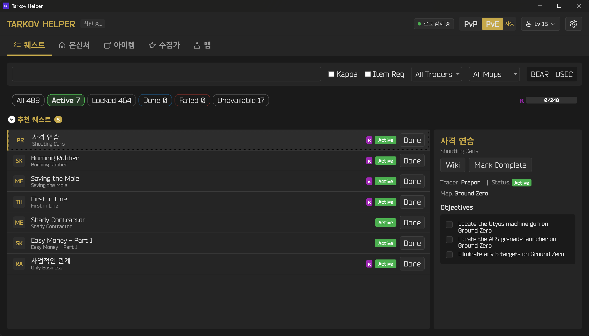
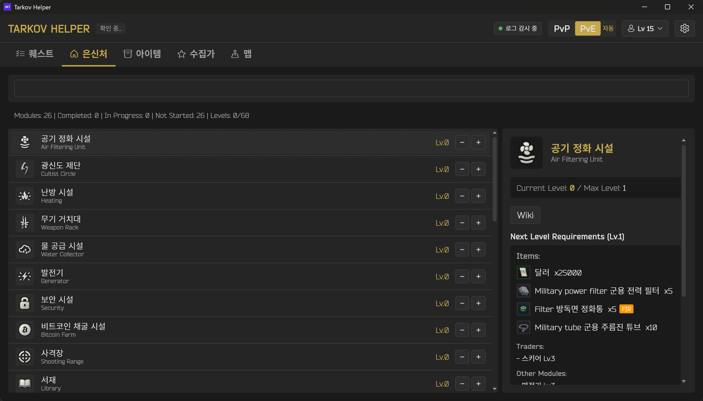
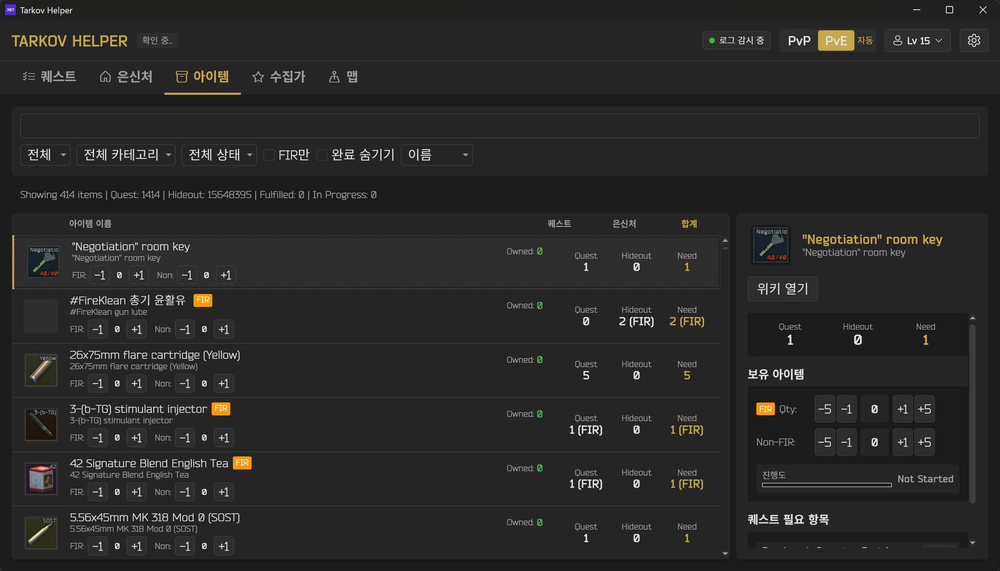

# TarkovHelper

[](README.md)
[](README_KR.md)
[](README_JA.md)

> **참고**: 이 저장소는 [Zeliper/Tarkov-Item-Helper](https://github.com/Zeliper/Tarkov-Item-Helper)에서 갈라져 나와 독립적으로 유지보수되는 포크입니다. 이 포크의 릴리즈는 CalVer(`YYYY.M.N`)를 사용하며 **v2026.7.0**부터 시작합니다.

Escape from Tarkov 퀘스트 및 은신처 진행 상황을 추적하는 Windows 데스크톱 애플리케이션입니다.

## 주요 기능

### 퀘스트 관리
- 모든 퀘스트 목록 조회 및 검색
- 퀘스트 완료/진행중 상태 추적
- 선행 퀘스트 및 후속 퀘스트 표시
- 퀘스트 시작 시 선행 퀘스트 자동 완료 처리
- 퀘스트 위키 링크 연결

### 은신처 관리
- 은신처 시설별 건설 레벨 추적
- 각 레벨 업그레이드에 필요한 아이템 표시
- 필요 트레이더, 스킬, 의존 시설 정보 제공

### 필요 아이템 추적
- 진행중인 퀘스트에 필요한 아이템 집계
- 은신처 건설에 필요한 아이템 집계
- 일반 아이템과 FIR(Found in Raid) 아이템 구분 추적
- 보유 수량 및 남은 필요 수량 계산
- 아이템 위키 링크 및 아이콘 표시

### 게임 로그 모니터링
- 게임 로그에서 퀘스트 완료 자동 감지
- BSG 런처 및 Steam 버전 모두 지원
- 게임 설치 폴더 자동 탐지

### 다국어 지원
- 한국어 / 영어 / 일본어 지원
- 실시간 언어 전환

## 스크린샷

<!-- 스크린샷 추가 예정 -->




## 설치 방법

### 요구 사항
- Windows OS
- [.NET 8.0 Desktop Runtime](https://dotnet.microsoft.com/download/dotnet/8.0)

### 릴리즈 다운로드
[Releases](../../releases) 페이지에서 최신 버전을 다운로드하세요.

### 소스에서 빌드
```bash
# 저장소 클론
git clone https://github.com/josephjang/Tarkov-Item-Helper.git
cd Tarkov-Item-Helper

# 빌드 및 실행
dotnet build -c Release
dotnet run -c Release
```

## 사용 방법

### 데이터 업데이트
앱을 처음 실행하면 [tarkov.dev](https://tarkov.dev) API에서 최신 퀘스트, 아이템, 은신처 데이터를 자동으로 가져옵니다.

수동으로 데이터를 업데이트하려면:
```bash
dotnet run -- --fetch
```

### 퀘스트 추적
1. **퀘스트** 탭에서 퀘스트 목록 확인
2. 체크박스로 완료 상태 표시
3. 검색창으로 퀘스트 검색
4. 퀘스트 클릭 시 상세 정보 및 선행/후속 퀘스트 확인

### 은신처 추적
1. **은신처** 탭에서 시설 목록 확인
2. 각 시설의 현재 레벨 설정
3. 다음 레벨 업그레이드에 필요한 아이템 확인

### 필요 아이템 확인
1. **필요 아이템** 탭에서 전체 필요 아이템 확인
2. 보유 수량 입력으로 진행 상황 추적
3. FIR 아이템은 별도로 관리

### 게임 로그 연동
게임 설치 폴더를 자동 감지하여 퀘스트 완료 시 알림을 받을 수 있습니다.

## 기술 스택

- **프레임워크**: .NET 8.0, WPF
- **언어**: C# 13
- **API**: [tarkov.dev GraphQL API](https://tarkov.dev)

## 데이터 저장 위치

모든 데이터는 `Data/` 폴더에 저장됩니다:
- `tasks.json` - 퀘스트 데이터
- `items.json` - 아이템 데이터
- `hideouts.json` - 은신처 데이터
- `progress.json` - 사용자 진행 상황
- `settings.json` - 언어 설정

## 라이선스

[MIT License](LICENSE)

## 크레딧

- 원본 프로젝트: [Zeliper/Tarkov-Item-Helper](https://github.com/Zeliper/Tarkov-Item-Helper)
- 게임 데이터: [tarkov.dev](https://tarkov.dev)
- Escape from Tarkov는 Battlestate Games의 상표입니다.
